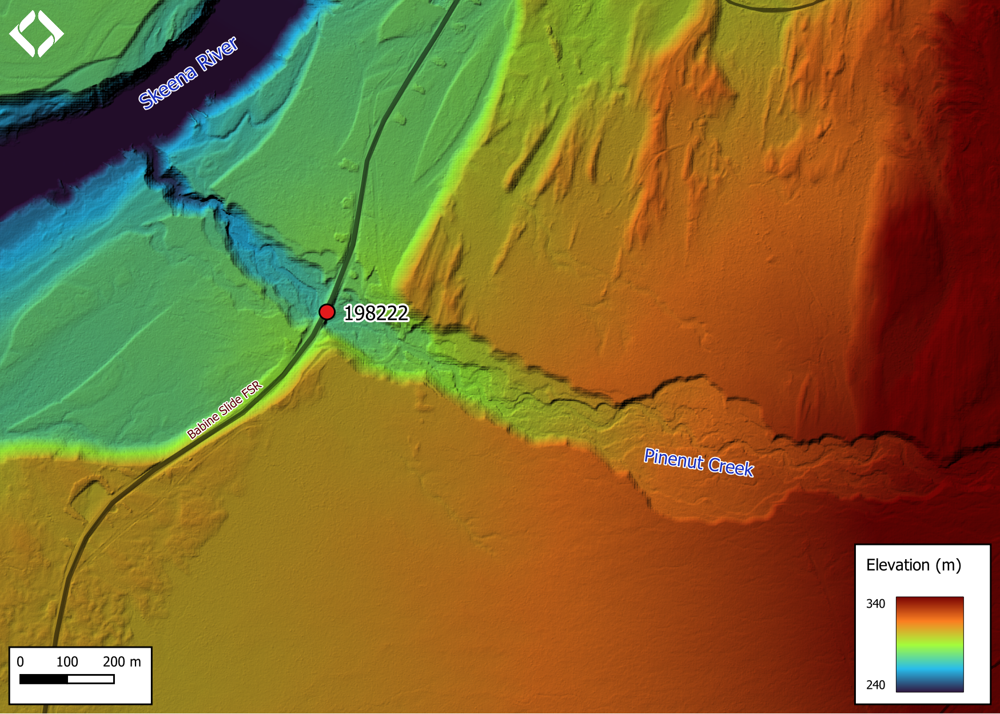

```{r setup-198222, eval = F}
knitr::opts_chunk$set(echo=FALSE, message=FALSE, warning=FALSE)
source('scripts/packages.R')
source('scripts/tables.R')
source('scripts/functions.R')
```

```{r  load-data-198222}
my_site <- 198222

```

`r fpr::fpr_appendix_title()`

## Site Location {.unnumbered}

PSCIS crossing `r as.character(my_site)` is located on
`r fpr_my_pscis_info(col_pull = road_name)`, on
`r fpr::fpr_my_pscis_info()`, approximately 15km north east of the small community of Glen Vowell, BC.
Crossing `r as.character(my_site)` was located on the east side of the Skeena River, approximately
`r round(fpr::fpr_my_bcfishpass(col_pull = downstream_route_measure)*0.001, 1)`km
upstream from the confluence.

<br>

## Background {.unnumbered}

At crossing `r as.character(my_site)`, `r fpr::fpr_my_pscis_info()` is a
`r fpr::fpr_my_bcfishpass() %>% english::ordinal()` order stream with a
watershed area upstream of the crossing of approximately
`r fpr::fpr_my_wshd()`km^2^. The elevation of the watershed ranges from
a maximum of `r fpr::fpr_my_wshd(col = 'elev_max')`m to
`r fpr::fpr_my_wshd(col = 'elev_min')`m near the crossing (Table
\@ref(tab:tab-wshd-198222)). At the time of reporting, there was no fisheries information available
for the area upstream of crossing `r as.character(my_site)`[@moe2020KnownBC; @norris2022smnorrisbcfishobs].

<br>

```{r tab-wshd-198222, eval = T}
fpr::fpr_table_wshd_sum(site_id = my_site) %>% 
  fpr::fpr_kable(caption_text = paste0('Summary of derived upstream watershed statistics for PSCIS crossing ', my_site, '.'),
           footnote_text = 'Elev P60 = Elevation at which 60% of the watershed area is above',
           scroll = F)

```

<br>

PSCIS stream crossing `r as.character(my_site)` was ranked as a high
priority for follow up by the Society for Ecosystem Restoration in Northern BC due to significant quantities of habitat
upstream modelled by `bcfishpass` as likely suitable for salmon rearing.
A summary of habitat modelling outputs is presented in Table
\@ref(tab:tab-culvert-bcfp-198222) and a map of the watershed is
provided in map attachment
[`r fpr::fpr_my_bcfishpass(col_pull = dbm_mof_50k_grid)`](`r fpr::fpr_my_mapsheet(wshd = "kisp", archive_date = "2022-09-06")`).

<br>

```{r tab-culvert-bcfp-198222, eval = T}
fpr::fpr_table_bcfp(scroll = gitbook_on) 
```

<br>

```{r lidar-pinenut, fig.cap = 'Lidar generated digital elevation model of Pinenut Creek at Babine Slide FSR (using elevation data from 2019).',eval=T}

```

<br>

## Stream Characteristics at Crossing {.unnumbered}

At the time of the survey, PSCIS crossing `r as.character(my_site)` was
un-embedded, non-backwatered and ranked as a
`r fpr::fpr_my_pscis_info(col_pull = barrier_result) %>% stringr::str_to_lower()`
to upstream fish passage according to the provincial protocol
[@moe2011Fieldassessment] (Table \@ref(tab:tab-culvert-198222)). This crossing was replaced in 1985. Water
temperature was
`r fpr::fpr_my_habitat_info(col_pull = 'temperature_c')`$^\circ$C, pH
was `r fpr::fpr_my_habitat_info(col_pull = 'p_h')` and conductivity was
`r fpr::fpr_my_habitat_info(col_pull = 'conductivity_m_s_cm')`uS/cm.

`r if(identical(gitbook_on, FALSE)){knitr::asis_output("\\pagebreak")}`
<br>

```{r tab-culvert-198222, eval = T}
fpr::fpr_table_cv_summary_memo()

```

```{r eval=F}
##this is useful to get some comments for the report
hab_site %>% filter(site == my_site & location == 'ds') %>% pull(comments)
hab_site %>% filter(site == my_site & location == 'us') %>% pull(comments)

```

## Stream Characteristics Downstream {.unnumbered}

`r fpr_my_survey_dist(loc = 'ds')`
`r if(gitbook_on){knitr::asis_output("(Figures \\@ref(fig:photo-198222-01) - \\@ref(fig:photo-198222-02)).")}else(knitr::asis_output("(Figure \\@ref(fig:photo-198222-d01))."))`
`r fpr_my_habitat_paragraph(loc = 'ds')` The habitat
was rated as `r fpr::fpr_my_priority_info(loc = 'ds')` value for
salmonid rearing and spawning.

## Stream Characteristics Upstream {.unnumbered}

`r fpr_my_survey_dist(loc = 'us')` `r if(gitbook_on){knitr::asis_output("(Figures \\@ref(fig:photo-198222-03) - \\@ref(fig:photo-198222-06)).")}else(knitr::asis_output("(Figure \\@ref(fig:photo-198222-d02))."))`
`r fpr_my_habitat_paragraph(loc = 'us')` There is a collapsed bridge approximately 200m from crossing `r as.character(my_site)`. Some erosion was present along the sides of the bridge but there was no fish passage issue at the time of survey. This was a high energy system with numerous areas of multiple channels, islands and elevated bars. High flows were pushing most of the large woody debris out of the main channel, resulting in lower complexity. There were rare pockets of gravel suitable for spawning. Overall, the habitat surveyed upstream of the crossing was
rated as `r fpr::fpr_my_priority_info(loc = 'us')` value as an important
migration corridor containing habitat suitable for spawning and rearing.

<br>

## Fish Sampling {.unnumbered}

To assess potential impacts of the culvert on fisheries values in the stream, minnowtrapping was conducted upstream and downstream of the crossing. Two traps were set downstream of the crossing and two were set upstream; traps were left overnight. `r tab_fish_summary %>% filter(site_id == paste0(my_site, '_us')) %>% group_by(site_id) %>% janitor::adorn_totals() %>% filter(site_id == 'Total') %>% pull(count_fish)` dolly varden was captured upstream and `r tab_fish_summary %>% filter(site_id == paste0(my_site, '_ds')) %>% group_by(site_id) %>% janitor::adorn_totals() %>% filter(site_id == 'Total') %>% pull(count_fish)` dolly varden were captured downstream `r if(gitbook_on){knitr::asis_output("(Figures \\@ref(fig:photo-198222-07) - \\@ref(fig:photo-198222-08)).")}else(knitr::asis_output("(Figure \\@ref(fig:photo-198222-u03))."))` 

<br>

```{r tab-fish-dens-198222, eval=T}
source('scripts/functions.R')
my_caption <- paste0('Fish captured in minnowtraps set overnight upstream and downstream of PSCIS crossing ', my_site, '.')

tab_fish_mt() %>% 
  fpr::fpr_kable(caption_text = my_caption, scroll = F)
```

<br>

## Structure Remediation and Cost Estimate {.unnumbered}

Should restoration/maintenance activities proceed, replacement of PSCIS
crossing `r as.character(my_site)` with a bridge
(`r fpr::fpr_my_pscis_info(col_pull = recommended_diameter_or_span_meters)`m
span) is recommended. The cost of the work is estimated at
\$`r format(fpr::fpr_my_cost_estimate(), big.mark = ',')` for a cost
benefit of `r fpr::fpr_my_cost_estimate(col_pull = cost_net)` linear
m/\$1000 and `r fpr::fpr_my_cost_estimate(col_pull = cost_area_net)`
m^2^/\$1000.

<br>

## Conclusion {.unnumbered}

Modelling indicates there is 
`r fpr::fpr_my_priority_info(col_pull= upstream_habitat_length_km)`km of
habitat upstream of crossing `r as.character(my_site)` suitable for steelhead rearing, with
areas surveyed rated as
`r fpr::fpr_my_priority_info(sit = my_site, loc = 'us', col_pull = hab_value)`
value for rearing and spawning. Although minnnow trapping is not considered a robust sampling method to definitively determine species composition - results indicated only dolly varden presence immediately adjacent to the crossing. Besides the drop at the outlet, crossing
`r as.character(my_site)` was in good condition and backwatering of the pipe could be considered if cost of replacement precludes remdiation efforts.  Overall the site was ranked as a
`r fpr::fpr_my_priority_info(col_pull = priority)` priority for
proceeding to design for replacement. 

`r if(gitbook_on){knitr::asis_output("<br>")} else knitr::asis_output("\\pagebreak")`

<br>

```{r tab-habitat-summary-198222}
tab_hab_summary %>% 
  filter(Site  == my_site) %>% 
  # select(-Site) %>% 
  fpr::fpr_kable(caption_text = paste0('Summary of habitat details for PSCIS crossing ', my_site, '.'),
                 scroll = F) 

```

<br>


```{r photo-198222-01-prep, eval=T}
my_photo1 = fpr::fpr_photo_pull_by_str(str_to_pull = '_d1_')

my_caption1 = paste0('Typical habitat downstream of PSCIS crossing ', my_site, '.')


```

```{r photo-198222-01, fig.cap= my_caption1, out.width = photo_width, eval=gitbook_on}
grid::grid.raster(jpeg::readJPEG(my_photo1))
```

<br>

```{r photo-198222-02-prep}
my_photo2 = fpr::fpr_photo_pull_by_str(str_to_pull = '_d2_')

my_caption2 = paste0('Typical habitat downstream of PSCIS crossing ', my_site, '.')
```

```{r photo-198222-02, fig.cap= my_caption2, out.width = photo_width, eval=gitbook_on}
grid::grid.raster(jpeg::readJPEG(my_photo2))

```

<br>

```{r photo-198222-d01, fig.cap = my_caption, fig.show="hold", out.width= c("49.5%","1%","49.5%"), eval=identical(gitbook_on, FALSE)}

my_caption <- paste0('Left: ', my_caption1, ' Right: ', my_caption2)

knitr::include_graphics(my_photo1)
knitr::include_graphics("fig/pixel.png")
knitr::include_graphics(my_photo2)
```

```{r photo-198222-03-prep}
my_photo1 = fpr::fpr_photo_pull_by_str(str_to_pull = '_u1_')

my_caption1 = paste0('Typical habitat upstream of PSCIS crossing ', my_site, '.')
```

```{r photo-198222-03, fig.cap= my_caption1, out.width = photo_width, eval=gitbook_on}
grid::grid.raster(jpeg::readJPEG(my_photo1))
```

<br>

```{r photo-198222-04-prep}
my_photo2 = fpr::fpr_photo_pull_by_str(str_to_pull = '_u2_')

my_caption2 = paste0('Collapsed bridge upstream of PSCIS crossing ', my_site, '.')

```

```{r photo-198222-04, fig.cap= my_caption2, out.width = photo_width, eval=gitbook_on}
grid::grid.raster(jpeg::readJPEG(my_photo2))
```

```{r photo-198222-d02, fig.cap = my_caption, fig.show="hold", out.width= c("49.5%","1%","49.5%"), eval=identical(gitbook_on, FALSE)}

my_caption <- paste0('Left: ', my_caption1, ' Right: ', my_caption2)

knitr::include_graphics(my_photo1)
knitr::include_graphics("fig/pixel.png")
knitr::include_graphics(my_photo2)
```

<br>

```{r photo-198222-05-prep}
my_photo1 = fpr::fpr_photo_pull_by_str(str_to_pull = '_u3_')

my_caption1 = paste0('Typical habitat upstream of PSCIS crossing ', my_site, '.')
```

```{r photo-198222-05, fig.cap= my_caption1, out.width = photo_width, eval=gitbook_on}
grid::grid.raster(jpeg::readJPEG(my_photo1))
```

```{r photo-198222-06-prep}
my_photo2 = fpr::fpr_photo_pull_by_str(str_to_pull = '_u4_')

my_caption2 = paste0('Typical habitat upstream of PSCIS crossing ', my_site, '.')

```

```{r photo-198222-06, fig.cap= my_caption2, out.width = photo_width, eval=gitbook_on}
grid::grid.raster(jpeg::readJPEG(my_photo2))
```

```{r photo-198222-u02, fig.cap = my_caption, fig.show="hold", out.width= c("49.5%","1%","49.5%"), eval=identical(gitbook_on, FALSE)}

my_caption <- paste0('Left: ', my_caption1, ' Right: ', my_caption2)

knitr::include_graphics(my_photo1)
knitr::include_graphics("fig/pixel.png")
knitr::include_graphics(my_photo2)
```

<br>

```{r photo-198222-07-prep}
my_photo1 = fpr::fpr_photo_pull_by_str(str_to_pull = '_mt1_')

my_caption1 = paste0('Dolly Varden captured downstream of PSCIS crossing ', my_site, '.')
```

```{r photo-198222-07, fig.cap= my_caption1, out.width = photo_width, eval=gitbook_on}
grid::grid.raster(jpeg::readJPEG(my_photo1))
```

```{r photo-198222-08-prep}
my_photo2 = fpr::fpr_photo_pull_by_str(str_to_pull = '_mt2_')

my_caption2 = paste0('Dolly Varden captured upstream of PSCIS crossing ', my_site, '.')

```

```{r photo-198222-08, fig.cap= my_caption2, out.width = photo_width, eval=gitbook_on}
grid::grid.raster(jpeg::readJPEG(my_photo2))
```

```{r photo-198222-u03, fig.cap = my_caption, fig.show="hold", out.width= c("49.5%","1%","49.5%"), eval=identical(gitbook_on, FALSE)}

my_caption <- paste0('Left: ', my_caption1, ' Right: ', my_caption2)

knitr::include_graphics(my_photo1)
knitr::include_graphics("fig/pixel.png")
knitr::include_graphics(my_photo2)
```
